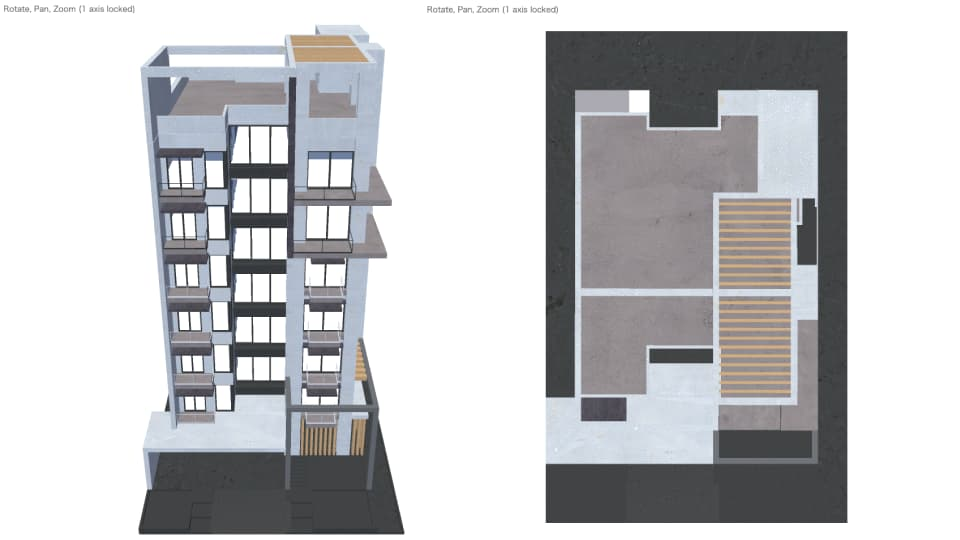

# three-seamless-ortho-transition

A seamless transition from perspective projection to orthographic projection inspired by the principle of Dolly Zoom.

## Demo

[Demo Link](https://shuya-tamaru.github.io/camera-switch-threejs/)

## 3D Model

Free model used: [Apartment Building 01](https://www.cgtrader.com/free-3d-models/exterior/house/apartment-building-01-fc9ca7eb-f970-45e1-927c-1fe1b47c337a) from CGTrader
